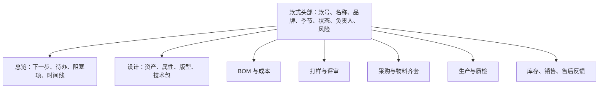
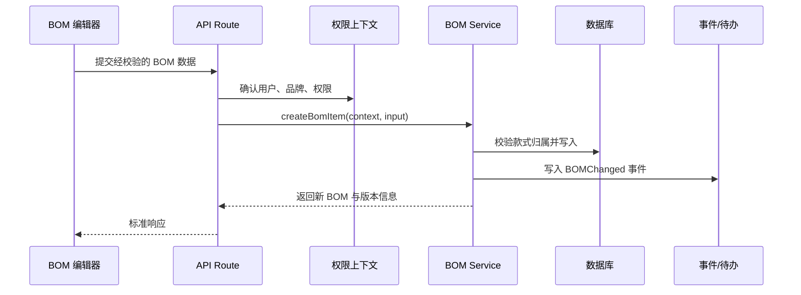

# Fashion AI PLM 项目规划与三层架构实施指南

> 面向当前项目阶段：已有较多页面、接口与数据库表，但尚未形成稳定的多品牌产品主线。本文不要求先懂后端；它的作用是帮你明确“这个项目是什么、先做什么、哪些代码应该放在哪里、页面应该怎么长”。

## 0. 先说结论：你现在卡在哪里

你并不是缺少功能。当前项目已经有企划、款式、BOM、打样、采购、生产、质检、库存、销售、售后、AI 和设置等模块，属于“功能版图已经铺开”的阶段。

真正的卡点是三个问题没有统一答案：

1. **业务主线是什么？** 页面很多，但一个品牌从“做一季货”到“复盘下一季”的主流程尚未成为产品骨架。
2. **数据归谁？** 多品牌时，每条款式、BOM、AI 结果、文件和报表应属于哪个公司、哪个品牌、哪个季节，目前尚未完全明确。
3. **代码如何持续扩展？** 页面和 API 可以继续增加，但若没有统一的权限、数据、状态和组件边界，每加一项功能都会变慢。

这不是“后端是否正确”的单一问题。它同时涉及产品设计、前端体验、数据设计和后端安全。建议把项目按下文三层理解：

```text
产品与前端显示层：用户看什么、如何完成工作
软件应用层：页面、接口、业务规则如何协作
系统与数据层：用户、权限、数据、文件、AI 如何安全运行
```

## 1. 项目定位：先收窄第一版的成功标准

### 1.1 推荐的第一目标

不要试图在第一版成为完整 ERP、完整 SCM、完整 BI 和万能 AI 工具。更适合当前项目的定位是：

> 面向服装品牌商品开发团队的多品牌 PLM 协同平台。以季节企划和款式开发为中心，打通设计资产、BOM、打样、采购协同、生产质量和销售反馈，并提供可追溯的 AI 辅助。

第一阶段优先服务的用户应是：品牌负责人、商品企划、设计师、开发跟单、采购、生产/质检负责人。销售、仓储、供应商协同可以先以数据录入/导入和有限查看方式支持，而不急于替代外部 OMS、WMS、ERP。

### 1.2 一条必须跑通的产品故事

任何功能是否优先，都先问：是否让以下故事更完整？


初期不需要每一步都自动化，但每一步都应该有：负责人、状态、关键附件/数据、时间、上一步和下一步。这样用户才会感到它是 PLM，而不是一组漂亮页面。

### 1.3 先定义 MVP 的边界

| 做到 | 暂不做 |
|---|---|
| 一个公司下管理多个品牌、多个季节 | 让所有客户自助注册和付费 |
| 款式从企划到样衣确认可协作和追溯 | 复杂 MRP、自动排产、财务总账 |
| BOM、技术包、打样、采购进度有版本与审批 | 取代 ERP/WMS 的全部库存和采购能力 |
| AI 生成草稿、分析、检索并由人确认 | AI 自动下单、自动批准、自动改生产数据 |
| 基础看板和问题预警 | 所有渠道的实时数据仓库 |

## 2. 三层架构：用通俗方式理解

### 2.1 前端显示架构：用户怎样“不迷路”

它解决的是：用户看到什么、先做什么、怎样从一个页面自然走到下一步。

例如“创建款式”不是只做一张表单，而是一个清晰的工作空间：用户知道它属于哪个品牌/季节、开发到哪一步、缺少什么、谁在负责、下一步该做什么。

### 2.2 软件应用架构：功能怎样“不互相打架”

它解决的是：点击保存后，如何验证数据、判断权限、更新状态、生成待办、记录日志。它通常体现为前端调用 API，API 调用业务服务，服务再读写数据库。

你无需把它理解成“很多后端技术”。它只是将“页面按钮里的一堆业务规则”放到统一、可复用、可测试的地方。

### 2.3 系统与数据架构：平台怎样“安全、稳定地记住一切”

它解决的是：谁能看见哪些品牌的数据、文件放在哪、AI 任务失败怎么办、如何备份、怎样与未来 ERP/电商连接。这是多品牌平台不能省略的地基。

## 3. 产品与前端显示架构

### 3.1 应该按“工作空间”而不是功能清单导航

当前页面可以保留，但主导航建议重组为六个工作空间：

```text
工作台
├─ 我的待办 / 风险 / 最近访问
├─ 品牌与季节总览
├─ 企划中心
├─ 商品开发中心
├─ 供应链与生产中心
├─ 经营反馈中心
└─ 平台设置
```

| 工作空间 | 用户要完成的目标 | 首屏必须回答的问题 |
|---|---|---|
| 工作台 | 今天该处理什么 | 我有哪些待办、逾期、审批、风险？ |
| 品牌与季节 | 选择工作上下文 | 正在管理哪个品牌、哪个季节、处于什么阶段？ |
| 企划中心 | 决定做什么货 | 本季目标、品类结构、主题、波段是否确定？ |
| 商品开发 | 把想法变成可开发款式 | 每个款式卡在设计、打样还是成本？ |
| 供应链与生产 | 确保按时按质交付 | 哪些物料、样衣、生产单存在风险？ |
| 经营反馈 | 把结果带回下一季 | 哪些款卖得好、退货原因是什么、应如何复盘？ |

### 3.2 全局上下文必须常驻

在所有业务页面顶部固定显示：

```text
[公司]  [品牌 ▼]  [季节 ▼]  [工作台]                     [搜索] [通知] [用户]
```

这不是装饰。它是多品牌系统最重要的前端安全提示：用户需要随时知道“我现在正在修改哪个品牌的哪一季”。

切换品牌或季节时：

- 刷新当前数据范围；
- 提示未保存内容；
- URL 同步上下文，例如 `/brands/{brandId}/seasons/{seasonId}/styles`；
- 页面标题、导出文件、上传目录、AI 会话都带上该上下文。

### 3.3 款式详情页应成为核心“作战室”

当前很多功能围绕款式，应该把款式详情设计为最完整的业务工作台，而不是若干独立页的集合。



推荐使用“总览 + 标签页/侧栏”的信息架构：

| 区域 | 内容 | 目的 |
|---|---|---|
| 顶部摘要 | 状态、负责人、目标成本、关键日期、风险 | 10 秒内理解当前情况 |
| 总览 | 下一步行动、待办、阻塞项、动态时间线 | 引导协作，而非只展示数据 |
| 设计 | 设计稿、AI 图、属性、技术包版本 | 固化开发输入 |
| BOM/成本 | BOM 明细、报价、成本版本、差异 | 形成成本决策依据 |
| 打样 | 轮次、照片、意见、结论 | 管理修改闭环 |
| 供应链 | 采购、到货、缺料预警 | 管理交期风险 |
| 生产/质检 | 订单、进度、缺陷、返工 | 管理交付质量 |
| 经营反馈 | 销售、退货、问题聚合 | 让产品形成闭环 |

### 3.4 列表页不要只“列数据”

款式列表、采购列表、生产列表的基本结构应统一：

```text
范围（品牌 / 季节 / 集合）
筛选（状态、负责人、风险、日期、品类）
指标摘要（总数、逾期、风险、待审批）
视图切换（表格 / 看板 / 时间线）
批量操作（分配、状态变更、导出、提醒）
列表主体
```

其中看板最适合“状态流转”，表格最适合“比较字段”，时间线最适合“交期管理”。不要所有业务都用同一种卡片网格。

### 3.5 前端组件分层

| 层级 | 例子 | 原则 |
|---|---|---|
| 基础 UI | Button、Dialog、Input、Table、Badge | 不含任何 PLM 业务词汇 |
| 通用业务组件 | 用户选择器、品牌选择器、状态标签、文件上传、审计时间线 | 可在多个模块复用 |
| 领域组件 | BOM 编辑器、打样评审卡、成本差异表、生产进度面板 | 只服务一个明确领域 |
| 页面容器 | StyleDetailPage、PlanningWorkspace | 组织数据与布局，不放复杂业务计算 |

前端状态也分三类：

- **URL 状态**：品牌、季节、筛选、当前标签页；可分享、可刷新恢复。
- **服务端数据**：款式、BOM、审批、列表；用 React Query 缓存、失效和刷新。
- **局部交互状态**：弹窗开关、编辑草稿、拖拽位置；留在组件本地。

## 4. 软件应用架构：让开发变得可持续

### 4.1 每次业务操作应该走什么路径

以“新增一条 BOM”为例：



这条路径中：

- 前端负责让用户好用，不能决定用户是否有权限；
- API 负责 HTTP 请求/响应，不能堆满业务规则；
- Service 负责业务规则，例如“已发布技术包不能直接修改 BOM”；
- 数据库负责最终隔离和约束，例如“用户不能写其他品牌”；
- Event 负责后续提醒、看板刷新、AI 风险复算。

### 4.2 建议的代码目录

```text
app/
  (workspace)/brands/[brandId]/seasons/[seasonId]/
    dashboard/
    planning/
    styles/
    sourcing/
    production/
  api/
    styles/
    planning/
    ...

src/
  modules/
    identity/
      service.ts  repository.ts  policies.ts  schemas.ts
    styles/
      service.ts  repository.ts  schemas.ts  events.ts
      components/
    bom/
    sampling/
    sourcing/
    production/
    workflow/
    ai/
  shared/
    auth/  db/  validation/  errors/  events/  storage/
```

不用一次重构全部。新功能先按此结构写；旧 API 在修改时逐个迁移即可。

### 4.3 三个必须统一的“横切能力”

它们不是某个业务模块，但每个模块都需要：

1. **租户上下文**：从请求中得到当前用户、公司、品牌、季节和权限。
2. **数据校验**：用同一种 schema 验证 URL 参数、请求体和外部导入数据。
3. **审计/事件**：关键改变自动记录“谁在何时把什么从什么改成什么”，并为通知和报表提供数据。

可把它们理解为“系统插座”：后续每加一个功能，直接插上，不再重新手写认证、错误处理和日志。

### 4.4 业务规则要显式写出来

目前最容易被遗漏的不是表字段，而是规则。建议为每个核心流程写一页规则表：

| 领域 | 规则例子 |
|---|---|
| 季节 | 已归档季节只读；已锁定季节只能走变更审批 |
| 款式 | 款号在同一品牌内唯一，而非全平台唯一 |
| BOM | 已用于生产单的 BOM 不可原地修改，应创建新版本 |
| 打样 | 样衣未通过不能进入“采购可执行”状态 |
| 采购 | 超预算或交期过近需要审批/预警 |
| 质检 | 不合格必须有处置结论，不能直接关闭 |
| AI | AI 输出需标记模型与输入来源，正式采用需人工确认 |

把这些规则写入 service、数据库约束和 UI 提示，而不是只写在需求文档中。

## 5. 系统与数据架构：多品牌平台的地基

### 5.1 数据隔离的简单解释

“多品牌”不等于在品牌名称上加一个筛选框。真正的多品牌是：即使有人手动修改请求、猜测 ID、直接调用接口，也无法读写无权品牌的数据。

必须同时有三层保护：

```text
前端：只展示当前品牌可访问的入口（体验层）
API：验证用户是否属于当前品牌并有对应动作权限（应用层）
数据库 RLS：即便 API 出错，也拒绝越权数据操作（最后防线）
```

### 5.2 核心数据主链

```text
companies
  └─ brands
      └─ seasons
          └─ collections / plans
              └─ styles
                  ├─ design_assets
                  ├─ tech_pack_versions
                  ├─ bom_versions / bom_items
                  ├─ samples / sample_reviews
                  ├─ purchase_orders / receipts
                  ├─ production_orders / qc_inspections
                  └─ inventory_transactions / sales_facts / after_sales_cases
```

建议：所有叶子表都直接保留 `company_id`、`brand_id`，重要业务表再保留 `season_id` 和 `style_id`。这会重复少量字段，但可以显著简化权限、筛选、索引、归档与分析。

### 5.3 数据库不应只是“存表单”

下面三种信息需要区分：

| 数据类型 | 例子 | 写入特点 |
|---|---|---|
| 当前状态 | 款式当前名称、负责人、当前阶段 | 可以更新 |
| 业务事实 | 一次到货、一次质检、一次库存变动、一次销售 | 通常新增，不应被覆盖 |
| 发布快照 | 已批准 BOM、已下达技术包、成本版本 | 不可变，用于追溯 |

尤其是库存、成本、生产和质检，不能只靠“当前数量/当前价格”字段。保留事实流水，才可知道为什么数字变了。

### 5.4 文件与图片架构

服装 PLM 的资产多且重要，文件架构需尽早固定：

```text
company/{companyId}/brand/{brandId}/season/{seasonId}/
  styles/{styleId}/
    design/{assetId}/original.ext
    tech-packs/{versionId}/document.pdf
    samples/{sampleId}/photos/{fileId}.jpg
    qc/{inspectionId}/photos/{fileId}.jpg
```

数据库保存文件元数据：文件用途、归属实体、版本、上传者、敏感级别、哈希、缩略图路径、归档状态。不要只在业务表里保存一条裸 URL。

### 5.5 异步任务：为什么需要它

用户点击“分析设计图”或“导入销售数据”后，浏览器不应一直等待几十秒。正确体验是：提交任务 → 显示处理中 → 完成后通知/刷新结果。

需要异步处理的包括 AI、生图、批量导入、文件处理、外部系统同步、报表计算和通知。初期只要一个 `jobs` 表和 Worker 就够，不需要复杂的大型队列系统。

## 6. AI 的产品与系统架构

### 6.1 AI 按“场景”组织，不按“模型”组织

用户不关心调用了什么模型，他们关心能否完成任务。推荐先定义场景卡片：

| 场景 | 输入 | 输出 | 人工动作 |
|---|---|---|---|
| 设计图解析 | 图片、品牌/季节上下文 | 品类、颜色、面料、工艺建议 | 采纳/编辑属性 |
| 技术包草稿 | 款式属性、设计资产 | 尺码/工艺/BOM 初稿 | 审核并发布版本 |
| 企划助手 | Brand DNA、历史销售、趋势素材 | 主题/品类/价格带建议 | 选择并形成企划 |
| 销量与风险预警 | 销售、库存、交期数据 | 风险解释与建议 | 创建待办/调整计划 |
| 售后复盘 | 原因、图片、渠道数据 | 问题聚类与改进建议 | 形成质量改进项 |

### 6.2 每个 AI 结果要能回答五个问题

1. 谁发起的？属于哪个品牌和季节？
2. 用了哪些输入资料？
3. 使用了哪个模型和提示词版本？
4. 输出是否被人编辑、采纳、驳回？
5. 它的成本、耗时和效果如何？

这就是 AI 任务、结果和评估表存在的原因。它们不是“复杂后端”，而是为了不让 AI 结果变成无法追溯的一段文本。

## 7. 从当前版本开始的开发优先级

### 第 0 轮：停止继续横向铺页面

当前最重要的策略是：在主线跑通前，停止继续新增很大的独立模块。每新增一个页面前先回答它归属于哪个工作空间、引用哪个主实体、谁能使用、产生什么状态/事件。

### 第 1 轮：建立多品牌地基（P0）

1. 建 `Company → Brand → Season → Style` 的完整数据关系。
2. 所有业务接口接入统一登录、品牌上下文和权限校验。
3. 重做数据库 RLS；移除匿名全读写策略。
4. 为核心表补 `company_id`、`brand_id`、`season_id` 并回填当前数据。
5. 统一数据库 migration 管理，固定一套类型生成方式。
6. 在前端放置全局品牌/季节切换器，并把上下文写入 URL。

**验收故事**：用户 A 属于品牌 A，用户 B 属于品牌 B；两人相互无法看到、搜索、上传、下载或修改对方任何款式数据。

### 第 2 轮：跑通“一个款式”的开发闭环（P1）

1. 改造款式详情为核心工作台。
2. 打通设计资产 → 技术包 → BOM → 打样评审 → 采购准备的顺序。
3. 引入状态机、待办、审批和动态记录。
4. 加入 BOM/技术包/打样评审的版本化。
5. 统一列表页的筛选、状态、风险与批量操作。

**验收故事**：品牌负责人可以从一个季节企划创建款式，设计师补齐资料，开发人员完成打样评审，负责人看到成本/交期风险并批准进入采购准备；每一步有责任人和记录。

### 第 3 轮：供应链与质量闭环（P1）

1. 采购订单、到货、物料齐套与缺料预警。
2. 生产订单、里程碑进度、质检、返工处置。
3. 库存流水而非单纯库存数量。
4. 以事件触发通知、看板、风险计算。

**验收故事**：某个款式因为关键面料晚到而被预警；影响到生产交期，并可追溯到采购单、供应商和责任人。

### 第 4 轮：AI 与经营反馈（P2）

1. 将现有 AI 接口改为可追踪的 AI Job。
2. 建立品牌知识库与 Brand DNA 的独立数据边界。
3. 接入销售/售后导入，形成款式与品类复盘。
4. 优先做“解释风险、生成草稿、辅助检索”，不要先做自动决策。

**验收故事**：品牌经理可以看到本季哪些款式的售后问题集中，系统关联对应设计、面料、工艺与质检记录，生成下一季可审阅的改进建议。

## 8. 每周开发的简单决策法

当你在两项功能之间犹豫，按以下顺序打分：

1. 是否让“品牌—季节—款式”主线更完整？
2. 是否降低了数据越权、重复录入或错误协作的风险？
3. 是否被至少两个角色高频使用？
4. 是否可复用为未来模块的基础能力？
5. 是否能在一到两周内做出可验证的闭环？

高分任务优先。纯视觉页面、独立 AI 演示、暂时没有数据来源的看板，通常排在后面。

## 9. 建议的近期任务 Backlog

| 顺序 | 任务 | 产出 | 为什么现在做 |
|---|---|---|---|
| 1 | 明确公司/品牌/季节/款式数据字典 | 实体关系图、字段清单 | 决定全部后续数据归属 |
| 2 | 实现 TenantContext 与权限中间件 | 所有 API 可统一保护 | 消除越权和重复鉴权 |
| 3 | 修改核心表和 RLS | 多品牌数据真正隔离 | 平台上线前必须完成 |
| 4 | 设计全局品牌/季节切换 | 统一工作上下文 | 用户不会在错误范围内工作 |
| 5 | 重构款式详情总览 | 一条清晰开发主线 | 让已有模块真正连起来 |
| 6 | 建工作流/待办/动态的最小版本 | 状态变化可协作可追溯 | 从“数据录入”升级为“流程管理” |
| 7 | BOM/技术包版本与审批 | 正式发布快照 | 支撑打样和采购的可信输入 |
| 8 | Job 基础设施 | AI、导入、通知的异步能力 | 为后续重任务提供统一通道 |

## 10. 你现在最需要做的三个决定

在写下一行代码前，建议先确定：

1. **初期服务对象**：是一个集团内部的多个品牌，还是多个互不相关的客户？前者可先做“公司内多品牌”，后者必须从第一天严格租户隔离。
2. **第一个完整闭环**：建议选择“企划 → 款式 → BOM/技术包 → 打样评审 → 采购准备”，不要同时追求生产、销售和售后的完整深度。
3. **数据主系统边界**：库存、销售订单、财务成本未来由哪个系统最终说了算？PLM 先作为开发协同中心，避免一开始和 ERP/WMS 争夺系统主数据。

## 11. 一句话行动建议

先不要继续加页面。用两到三周把“多品牌数据隔离 + 品牌/季节上下文 + 一款款式的开发闭环”做成可靠主干；后面的 AI、生产、销售和看板才能自然长在这根主干上，而不是继续变成彼此独立的功能岛。
